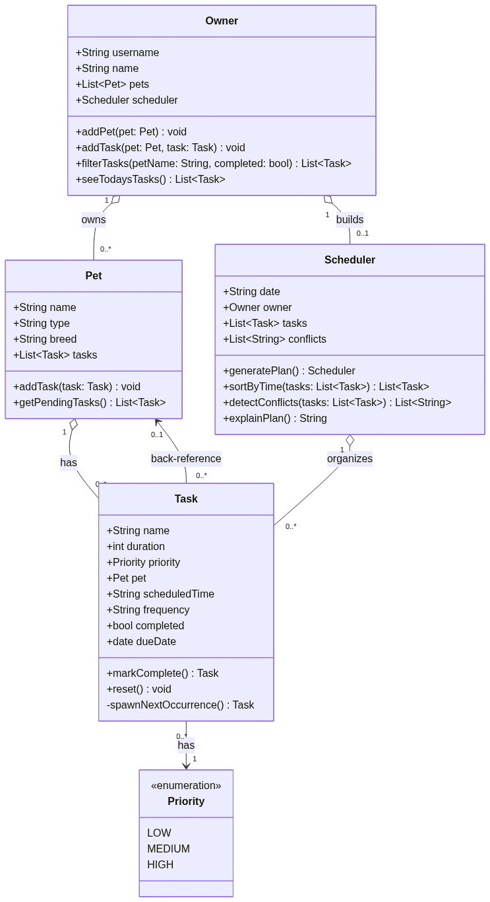

# PawPal+ (Module 2 Project)

You are building **PawPal+**, a Streamlit app that helps a pet owner plan care tasks for their pet.

## Scenario

A busy pet owner needs help staying consistent with pet care. They want an assistant that can:

- Track pet care tasks (walks, feeding, meds, enrichment, grooming, etc.)
- Consider constraints (time available, priority, owner preferences)
- Produce a daily plan and explain why it chose that plan

Your job is to design the system first (UML), then implement the logic in Python, then connect it to the Streamlit UI.

## What you will build

Your final app should:

- Let a user enter basic owner + pet info
- Let a user add/edit tasks (duration + priority at minimum)
- Generate a daily schedule/plan based on constraints and priorities
- Display the plan clearly (and ideally explain the reasoning)
- Include tests for the most important scheduling behaviors

## Getting started

### Setup

```bash
python -m venv .venv
source .venv/bin/activate  # Windows: .venv\Scripts\activate
pip install -r requirements.txt
```

### Suggested workflow

1. Read the scenario carefully and identify requirements and edge cases.
2. Draft a UML diagram (classes, attributes, methods, relationships).
3. Convert UML into Python class stubs (no logic yet).
4. Implement scheduling logic in small increments.
5. Add tests to verify key behaviors.
6. Connect your logic to the Streamlit UI in `app.py`.
7. Refine UML so it matches what you actually built.

## 🖥️ Sample Output

Paste a sample of your app's CLI or Streamlit output here so a reader can see what a generated plan looks like:

```
====================================================
              PAWPAL — TODAY'S SCHEDULE             
                 Owner: Jamie Smith                 
====================================================
Plan for 2026-07-06:

  Buddy (Golden Retriever)
  STATUS   TASK                 TIME    PRIORITY MINS   FREQUENCY   
  ------------------------------------------------------------------
  [    ]   Morning Walk         07:00   HIGH     30     daily       
  [    ]   Feeding              08:00   HIGH     10     twice daily 
  [    ]   Enrichment Play      17:00   MEDIUM   20     daily       

  Luna (Siamese)
  STATUS   TASK                 TIME    PRIORITY MINS   FREQUENCY   
  ------------------------------------------------------------------
  [    ]   Medication           09:00   HIGH     5      daily       
  [    ]   Grooming             14:00   LOW      15     weekly      
====================================================
  Total care time: 80 min across 5 tasks
====================================================
```

## 🧪 Testing PawPal+

```bash
# Run the full test suite:
python -m pytest

# Run with verbose per-test output:
python -m pytest -v

# Run with coverage:
python -m pytest --cov
```

`tests/test_pawpal.py` covers the core scheduling behaviors:

- **Sorting correctness** — tasks come back in chronological order, unscheduled tasks sort last, same-time tasks break ties by priority, and an empty task list doesn't error.
- **Recurrence logic** — completing a `"daily"` task spawns a next-day occurrence attached to the same pet, while non-recurring frequencies (e.g. `"once"`) spawn nothing.
- **Conflict detection** — `Scheduler.detect_conflicts()` flags tasks that share an exact time slot and stays silent when times don't collide.
- **Basic task/pet behavior** — marking a task complete updates its status, and adding a task to a pet updates that pet's task list.

Sample test output:

```
============================= test session starts ==============================
collected 10 items

tests/test_pawpal.py::test_mark_complete_changes_status PASSED           [ 10%]
tests/test_pawpal.py::test_add_task_increases_pet_task_count PASSED      [ 20%]
tests/test_pawpal.py::test_sort_by_time_orders_tasks_chronologically PASSED [ 30%]
tests/test_pawpal.py::test_sort_by_time_puts_unscheduled_tasks_last PASSED [ 40%]
tests/test_pawpal.py::test_sort_by_time_breaks_ties_by_priority PASSED   [ 50%]
tests/test_pawpal.py::test_sort_by_time_handles_empty_list PASSED        [ 60%]
tests/test_pawpal.py::test_mark_complete_on_daily_task_creates_next_day_occurrence PASSED [ 70%]
tests/test_pawpal.py::test_mark_complete_on_non_recurring_frequency_spawns_nothing PASSED [ 80%]
tests/test_pawpal.py::test_detect_conflicts_flags_duplicate_times PASSED [ 90%]
tests/test_pawpal.py::test_detect_conflicts_ignores_distinct_times PASSED [100%]

============================== 10 passed in 0.02s ==============================
```

Confidence Level: ★★★☆☆ (3/5)

The core behaviors requested — sorting, recurrence, and conflict detection — are tested and passing (10/10), so I'm confident in the happy paths and the specific edge cases we covered (ties, unscheduled tasks, non-recurring frequencies, empty lists). There are still several edge cases that remain untested.


## ✨ Features

- **Sorting by time** — `Scheduler.sort_by_time()` orders every task chronologically (via `_time_key()`), pushes unscheduled tasks to the end, and breaks same-time ties by priority.
- **Conflict warnings** — `Scheduler.detect_conflicts()` groups tasks by exact start time and surfaces a warning for any slot double-booked across one or more pets, without ever raising an exception.
- **Daily/weekly recurrence** — `Task.mark_complete()` calls `_spawn_next_occurrence()` to automatically create the next `"daily"` or `"weekly"` task instance on the same pet, using `RECURRENCE_INTERVALS` to compute the new due date.
- **Task filtering** — `Owner.filter_tasks(pet_name, completed)` lets the UI or CLI narrow the full task list by pet, completion status, both, or neither.
- **Plan explanation** — `Scheduler.explain_plan()` renders a human-readable, per-pet breakdown of the day's plan (status, time, priority, duration, frequency) plus a `WARNINGS:` section for any conflicts and a total-care-time summary.
- **Interactive UI (Streamlit)** — add owners, pets, and tasks; mark tasks complete inline; generate and regenerate a schedule; view conflicts and the full plan without leaving the browser.

## 🗺️ System Design (UML)



The diagram shows the four core classes — `Owner`, `Pet`, `Task`, and `Scheduler` — and how they relate: an `Owner` owns `Pet`s and builds a `Scheduler`, each `Pet` has `Task`s, and the `Scheduler` organizes and sorts those same `Task`s (each carrying a `Priority` enum value).

## 📐 Smarter Scheduling

| Feature | Method(s) | Notes |
|---------|-----------|-------|
| Task sorting | `Scheduler.sort_by_time()` | Sorts tasks chronologically by `scheduled_time` (parsed to minutes-since-midnight internally via `Scheduler._time_key()`). Unscheduled tasks sort last; tasks tied on the same time fall back to priority as a tiebreaker. Called automatically by `generate_plan()`. |
| Filtering | `Owner.filter_tasks(pet_name=None, completed=None)` | Narrows the owner's full task list by pet name and/or completion status — pass either, both, or neither to get everything. Used by the CLI demo and available to the Streamlit UI for "show me just Buddy's tasks" or "show me what's still pending." |
| Conflict handling | `Scheduler.detect_conflicts()` | Lightweight check that groups scheduled tasks by exact start time and flags any slot shared by more than one task (same pet or across different pets). Returns a list of warning strings rather than raising — `generate_plan()` stores them in `Scheduler.conflicts`, and `explain_plan()` prints them in a `WARNINGS:` section instead of crashing the program. |
| Recurring tasks | `Task.mark_complete()` → `Task._spawn_next_occurrence()` | Completing a `"daily"` or `"weekly"` task automatically creates the next occurrence and attaches it to the same pet. The next `due_date` is computed with `timedelta(days=1)` or `timedelta(weeks=1)` (see `RECURRENCE_INTERVALS`) added to the completed task's `due_date`. Non-recurring frequencies (e.g. `"twice daily"`) are left alone — `mark_complete()` just returns `None`. |

## 📸 Demo Walkthrough

### Main UI features

The Streamlit app (`app.py`) is organized into three sections:

- **Owner** — enter the owner's name, which is kept in `st.session_state` across reruns.
- **Add a Pet** — enter a pet's name, species, and breed and click **Add pet**. Pets show up in a running list; duplicate names are rejected with a warning.
- **Add a Task** — pick a pet from a dropdown, then set a task title, duration, priority, scheduled time, and frequency, and click **Add task**. Every task added so far is listed in a table with an inline **Complete** button that marks it done (and, for `"daily"`/`"weekly"` tasks, silently spawns tomorrow's occurrence).
- **Build Schedule** — click **Generate schedule** to run the `Scheduler` against the owner's current tasks. The app then shows any conflict warnings, a chronologically sorted table of all tasks, and an expandable "Plan details" section with the full text explanation from `explain_plan()`.

### Example workflow

1. Enter an owner name (e.g. "Jamie Smith").
2. Add a pet, e.g. `Buddy`, a `dog`, breed `Golden Retriever`.
3. Add a task for Buddy, e.g. `Morning Walk`, 30 minutes, `high` priority, scheduled `07:00`, frequency `daily`.
4. Add a second pet and a task that happens to land on the same time as one of Buddy's tasks (e.g. `09:00`) to see conflict detection in action.
5. Click **Generate schedule** to view today's plan, sorted by time, with any time-slot conflicts flagged as warnings.
6. Click **Complete** on a `daily` task and regenerate the schedule — a new occurrence for the next day is created automatically.

### Key Scheduler behaviors shown

- **Sorting by time** — the generated plan always lists tasks earliest-to-latest, regardless of the order they were added in.
- **Conflict warnings** — two tasks scheduled at the same time (even across different pets) trigger a warning banner instead of silently overwriting one another.
- **Daily recurrence** — completing a `"daily"` or `"weekly"` task automatically queues up its next occurrence rather than requiring the user to re-enter it.

### Sample CLI output

Running `python main.py` drives the same `Owner`/`Pet`/`Task`/`Scheduler` logic from the command line, including a conflict on purpose so the warning path is visible:

```
====================================================
              PAWPAL — TODAY'S SCHEDULE             
                 Owner: Jamie Smith                 
====================================================
Plan for 2026-07-06:

  Buddy (Golden Retriever)
  STATUS   TASK                 TIME    PRIORITY MINS   FREQUENCY   
  ------------------------------------------------------------------
  [    ]   Morning Walk         07:00   HIGH     30     daily       
  [done]   Feeding              08:00   HIGH     10     twice daily 
  [    ]   Vet Check-in         09:00   MEDIUM   15     daily       
  [    ]   Enrichment Play      17:00   MEDIUM   20     daily       

  Luna (Siamese)
  STATUS   TASK                 TIME    PRIORITY MINS   FREQUENCY   
  ------------------------------------------------------------------
  [    ]   Medication           09:00   HIGH     5      daily       
  [    ]   Grooming             14:00   LOW      15     weekly      

  WARNINGS:
  - Conflict at 09:00: Medication (Luna), Vet Check-in (Buddy)
====================================================
  Total care time: 95 min across 6 tasks
====================================================

Conflicts detected:
  ! Conflict at 09:00: Medication (Luna), Vet Check-in (Buddy)

Chronological order (sort_by_time):
  07:00  Buddy    Morning Walk     [pending]
  08:00  Buddy    Feeding          [done]
  09:00  Luna     Medication       [pending]
  09:00  Buddy    Vet Check-in     [pending]
  14:00  Luna     Grooming         [pending]
  17:00  Buddy    Enrichment Play  [pending]

Buddy's tasks only (filter_tasks(pet_name='Buddy')):
  Enrichment Play
  Morning Walk
  Feeding
  Vet Check-in

Pending tasks only (filter_tasks(completed=False)):
  Enrichment Play
  Morning Walk
  Vet Check-in
  Grooming
  Medication

Luna's pending tasks (filter_tasks(pet_name='Luna', completed=False)):
  Grooming
  Medication
```
